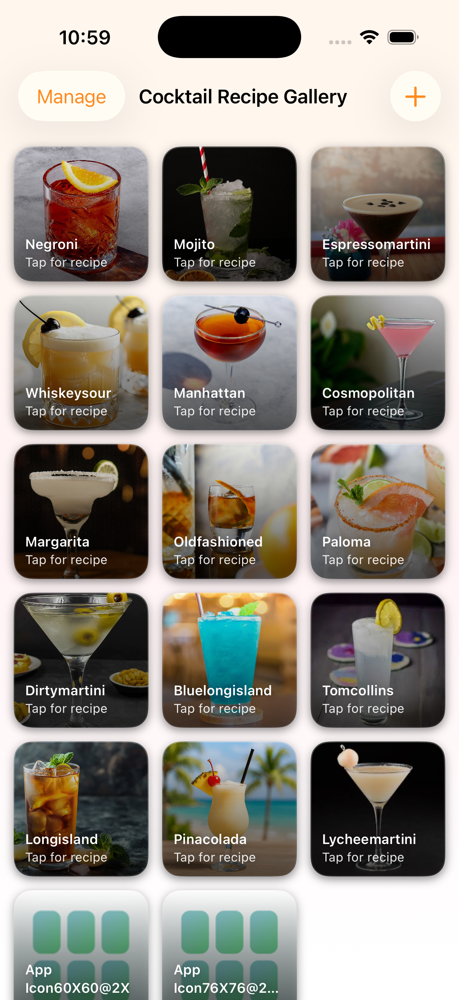
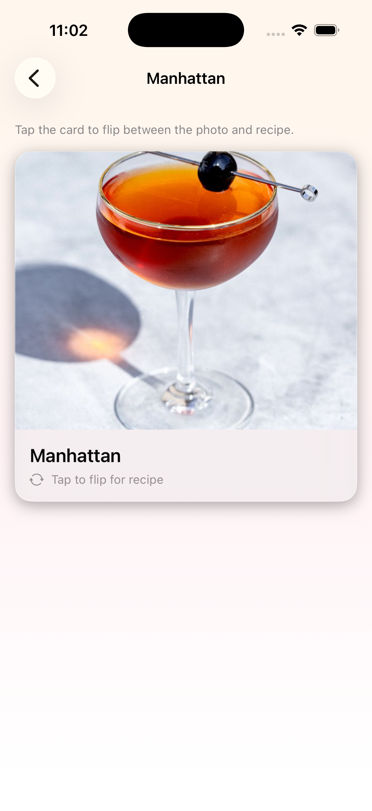
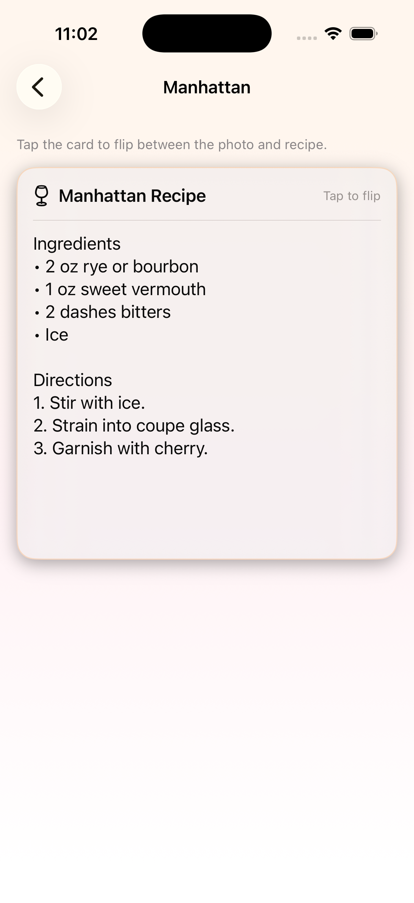
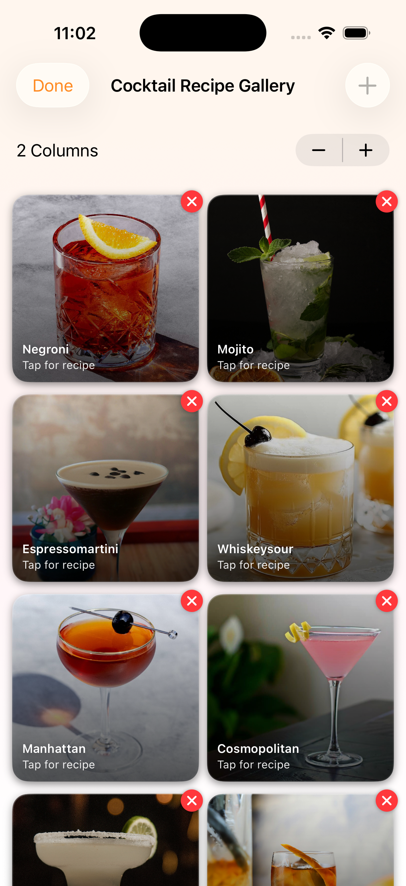

# iOS Image Gallery

A SwiftUI image gallery app built to showcase organized media browsing, clean visual layout, and an interactive detail-view experience in a polished mobile interface.

## Overview

This project was created as part of my iOS development portfolio to demonstrate visual UI design in SwiftUI. The app focuses on presenting image-based content in a clean and structured way, with a gallery-style layout that allows users to browse items, view details, flip between content states, and manage the gallery layout.

## Features

- Image gallery grid layout
- Tap-to-view detail experience
- Flip interaction between photo and recipe view
- Manage mode for gallery organization
- Clean visual structure
- SwiftUI-based interface with a polished browsing flow

## Built With

- Swift
- SwiftUI
- Xcode

## Screenshots

### Gallery Screen
Shows the main gallery layout with multiple visual items displayed in an organized grid.

### Detail Photo View
Shows the focused detail screen for an individual item with a larger image presentation.

### Recipe View
Shows the flipped detail card state, allowing the user to view recipe content instead of the image.

### Manage Gallery Mode
Shows the editable gallery layout with management controls for organizing displayed items.

## What This Project Demonstrates

- SwiftUI layout design
- Image-based UI structure
- Grid-style presentation
- Navigation between screens
- Interactive content states
- Clean visual hierarchy
- Reusable interface components

## Why I Built It

I wanted to practice building a more visual SwiftUI app that focused on presentation, structure, and user-friendly browsing. This project helped me strengthen my understanding of layout composition, screen flow, and interactive image-driven design.

## Status

Completed as a portfolio iOS project.

## Author

**Jessica Vargas**  
Data Analytics Student | App Developer 
